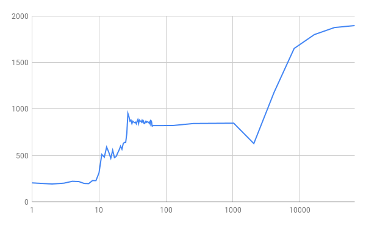
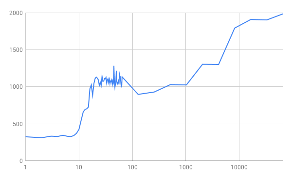
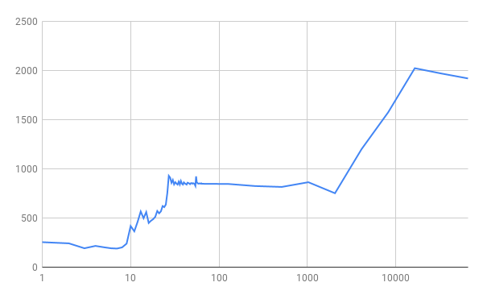

# Operating systems Three Easy Pieces: Chapter 18 solution

## Question 1

Since `gettimeofday` is a system call, it does take some time and there is a few micro second inaccuracy. My strategy here is to use only twice, so that the inaccuracy is negligible.

## Question 3

About 100000 iterations give pretty stable result. Some distortions remain which doesn't go away with 10x more iterations.

## Question 4

100000 iterations. Intel Core i7-9750H CPU @ 2.60GHz, 2592 Mhz, 6 Core(s), 12 Logical Processor(s) and 8GB RAM.

100000 iterations. AWS t2.micro instance with 1 vCPU and 1GB RAM.

Maybe because evolution in the savannah trained humans more to work with visual information than numbers.

## Question 5

Compiler doesn't seem to be removing any loops here. If it did, could be solved easily by adding some other simple instructions like incrementing a counter and printing that counter later.

## Question 6

When the programs runs for shorter length of time, the thread affinity doesn't cause much of a difference. But when it runs for long, the scheduler probably does bounce it around a few threads.

With thread affinity.

Without thread affinity. Never gets above 2000

## Question 7

Initialization doesn't effect this implementation.

# Notes

- The first level TLB is about 3.5x faster than the second level TLB. And the second level TLB is about 2.5x faster that third level TLB or plain page table.
- In the graph, right before switching to third level TLB, there is a jump in performance, weird.
